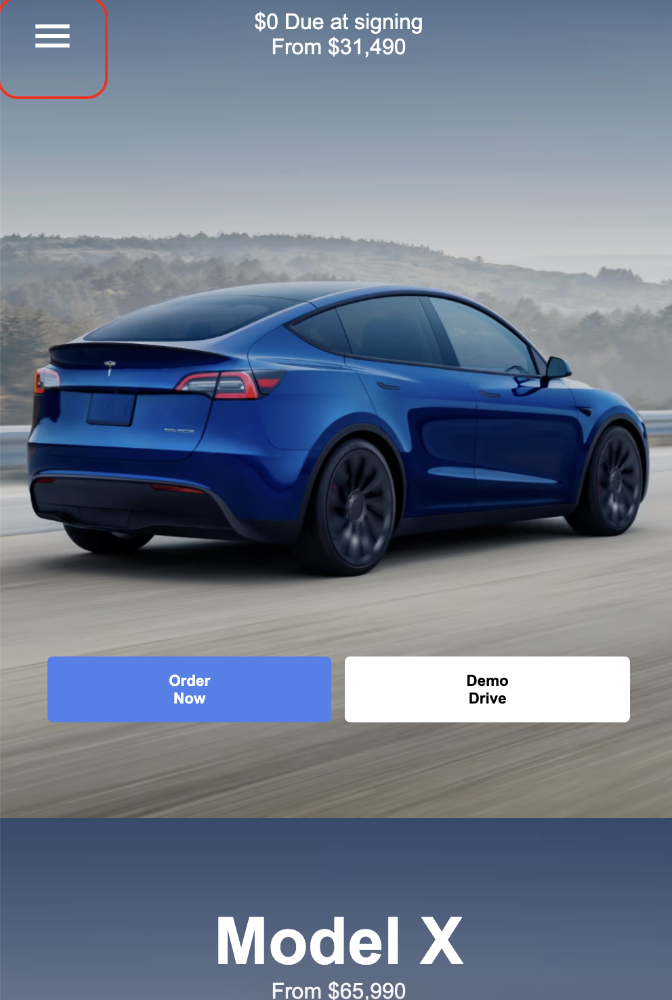

# Procesverslag
Markdown is een simpele manier om HTML te schrijven.  
Markdown cheat cheet: [Hulp bij het schrijven van Markdown](https://github.com/adam-p/markdown-here/wiki/Markdown-Cheatsheet).

Nb. De standaardstructuur en de spartaanse opmaak van de README.md zijn helemaal prima. Het gaat om de inhoud van je procesverslag. Besteedt de tijd voor pracht en praal aan je website.

Nb. Door *open* toe te voegen aan een *details* element kun je deze standaard open zetten. Fijn om dat steeds voor de relevante stuk(ken) te doen.

## Jij

  
uitwerken voor kick-off werkgroep

  ### Auteur:
 Daniël Prins

  #### Je startniveau:
  Blauw

  #### Je focus:
  hier je focus (kies uit responsive óf surface plane)
 

## Je website

  
uitwerken voor kick-off werkgroep

  ### Je opdracht:
  tesla.com

  #### Screenshot(s) van de eerste pagina (small screen): 
  Tesla.com Homepagina
  

  #### Screenshot(s) van de tweede pagina (small screen):
  Tesla.com Powerwall pagina
  
 

## Toegankelijkheidstest 1/2 (week 1)

  
uitwerken na test in 2e werkgroep

  ### Bevindingen
Ik begon de WCAG-test door de screenreader in te schakelen. In het begin had ik geen idee wat ik aan het doen was. De toetsen waren totaal niet duidelijk voor me, maar na een tijdje begon ik er langzaam aan gewend te raken en ging het steeds soepeler. De Tesla-pagina is behoorlijk minimalistisch, dus er gebeurde niet veel, wat het gebruik van de screenreader een stuk gemakkelijker maakte. Wat me opviel, zowel bij mijn screenreader als bij die van Brita, met wie ik de opdracht samen deed, was dat er enorm veel werd voorgelezen dat niet zichtbaar was op de pagina. Er werd veel extra informatie gedeeld over afbeeldingen die helemaal niet relevant waren voor wat je zag. Ook merkte ik dat de screenreader bij sommige afbeeldingen informatie gaf die van de hele site kwam, terwijl ik alleen maar wilde weten wat die ene afbeelding betekende. Ik vond het zelf best lastig.

## Breakdownschets (week 1)

  
uitwerken na afloop 3e werkgroep

  ### de hele pagina: 
  
  Ik heb de breakdown schets uitgetekent, want ik vind het dan makkelijker en overzichtelijker om te begrijpen wat elk deel van de website inhoudt. Dus hierboven zie je mijn getekende break down schets

## Voortgang 1 (week 2)

  
uitwerken voor 1e voortgang

  ### Stand van zaken
  Ik had een lastige start. Ik wilde in eerste instantie de website dopper kiezen, maar merkte na de eerste week dat die gewoon veel te hoog gegrepen was voor de piste waar ik op bevind. Ik wist hier nog niet zo goed welke website ik wel moest kiezen.

  ### Verslag van meeting
  hier na afloop snel de uitkomsten van de meeting vastleggen

  - Snel een nieuwe website vinden
  - Een begin maken

## Voortgang 2 (week 3)

  
uitwerken voor 2e voortgang

  ### Stand van zaken
  Hier liep ik echt enorm achter. Door mijn uitstel gedrag en door het kiezen van een te lastige website had ik gewoon nogsteeds niks staan. Hierdoor heb ik op een ander moment hulp gekregen van de student assistenten en ben daardoor wel echt enorm verder geholpen.

  ### Verslag van meeting
  - Keihard aan de bak gaan
  - Heel snel beginnen nu je de website hebt uitgekozen

## Toegankelijkheidstest 2/2 (week 4)

 
 
 
 
 

  ### Bevindingen
  - Contrast heb ik verbeterd
  - Ik heb meer nagedacht over een overzichtelijke screenplay
  - Mijn screenplay taal staat in het engels, maar de alternatieve tekst is in het nederlands, dus ik moet een van de twee aanpassen

## Voortgang 3 (week 4)

  
uitwerken voor 3e voortgang

  ### Stand van zaken
  Ik ben echt opgeschoten, maar ik ben super bang dat ik het niet ga halen. Het is wel echt mijn eigen schuld door te weinig tijd te stoppen in FED. Ik vind wat ik er mee kan super cool, maar het ligt me gewoon niet. Daardoor besteed ik liever tijd aan iets wat ik leuk vind ookal is dat echt de slechtste oplossing. 

  ### Verslag van meeting
  hier na afloop snel de uitkomsten van de meeting vastleggen

  - Inhaalsprint maken, want anders red je het niet

## Eindgesprek (week 5)

  
uitwerken voor eindgesprek

  ### Je uitkomst - karakteristiek screenshots:
  
Ik ben tevreden, maar niet volledig blij met het eindresultaat. Ik denk dat ik vanaf het begin veel meer tijd had moeten steken in het proces. Vaak denk ik dat het wel goedkomt, maar op een gegeven moment blijkt dat toch niet het geval te zijn, en dan zit ik met de gevolgen. Dat was hier zeker het geval. Het is me gewoon niet gelukt om alles voor week 5 af te krijgen. Nu, tijdens de herkansing, ben ik echt hard aan de slag gegaan en ben daar wel tevreden over. Maar als ik terugkijk op mijn leerproces, weet ik dat het beter had gekund. Toch ben ik echt blij met hoe mijn website werkt en eruitziet.

  ### Dit ging goed/Heb ik geleerd: 
  
Wat ik heb geleerd, is echt ontzettend veel. Ik ben misschien geen meester in CSS, maar ik heb zeker grote stappen gezet. Waar ik eerst elke keer weer flexbox moest opzoeken, kan ik nu in één keer zeggen waar ik iets wil plaatsen, zonder het internet te raadplegen. Ik vind wel dat ik trots mag zijn, maar ik blijf ook kritisch op mezelf. Dit vak heeft me echt geleerd dat het niet altijd vanzelf goedkomt en dat je alles zelf in handen hebt. Ik had eerst niks ingeleverd, dus helaas niet gehaald, maar dat betekent ook dat ik de enige ben die het kan veranderen. Daarom heb ik mijn uiterste best gedaan om er toch iets van te maken.

  ### Dit was lastig/Is niet gelukt:
  Korte omschrijving met plaatjes

  
  Er blijven constant dingen die ik zou willen verbeteren of mooier had willen maken. Bijvoorbeeld dat het me maar niet lukte om het Tesla-logo goed in beeld te krijgen, of dat de H1 bovenaan ineens verdwijnt op mobiel. Ik denk ook dat als ik eerder om hulp had gevraagd of gewoon eerder was begonnen, ik het echt veel toffer had kunnen maken.

## Bronnenlijst

  
continu bijhouden terwijl je werkt

  Nb. Wees specifiek ('css-tricks' als bron is bijv. niet specifiek genoeg). 
  Nb. ChatGpT en andere AI horen er ook bij.
  Nb. Vermeld de bronnen ook in je code.

  1. chatgpt prompt: Welk psuedo element hoort bij de 3e img
  2. Macpherson, E. (2019, 29 september). Two ways to create an image with a colour overlay in CSS. DEV Community. https://dev.to/ellen_dev/two-ways-to-achieve-an-image-colour-overlay-with-css-eio
  3. ARIA - Accessibility | MDN. (2024, 1 november). MDN Web Docs. https://developer.mozilla.org/en-US/docs/Web/Accessibility/ARIA
  4. CodeMentor. (2023, 25 november). How to create responsive navigation bar with HTML CSS And JavaScript [Video]. YouTube. https://www.youtube.com/watch?v=M498DvQDkJo
  5. Intavas. (2024, 26 januari). CSS Grid Tutorial - Crash Course in 14 minutes [Video]. YouTube. https://www.youtube.com/watch?v=9dNhbB6YthI
  6. Macpherson, E. (2019, 29 september). Two ways to create an image with a colour overlay in CSS. DEV Community. https://dev.to/ellen_dev/two-ways-to-achieve-an-image-colour-overlay-with-css-eio
  7. Coyier, C. (2024, 12 augustus). CSS Flexbox Layout Guide | CSS-Tricks. CSS-Tricks. https://css-tricks.com/snippets/css/a-guide-to-flexbox/
  8. W3Schools.com. (z.d.). https://www.w3schools.com/accessibility/accessibility_screen_readers.php
  9. chatgpt prompt: Hoe haal je de puntjes weg voor de list

